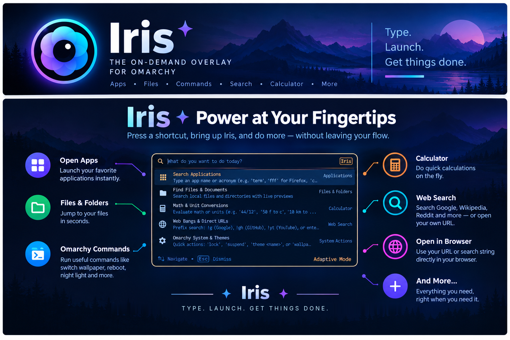

#  Iris
### A fast, elegant, keyboard-driven universal search overlay and quick launcher for the Omarchy Quattro shell



[](LICENSE)
[](https://github.com/fickleminded/iris)

**Iris** is a fast, elegant, keyboard-driven universal search engine and launcher built from the ground up for the **Omarchy Quattro** desktop shell.

Bringing the beloved Spotlight and Raycast overlay paradigm natively to Hyprland and Quickshell, Iris bridges file discovery, desktop application management, instant math evaluation, and system administration into a unified, responsive interface that expands with rich live previews when you need them and gets out of your way when you don't.

---

## 📥 Installation

### Prerequisites
Make sure you are running **Omarchy Quattro (Omarchy 4.0)** with **Quickshell** and **Hyprland**, along with the following standard utilities:
- `fd` (for high-speed file search)
- `wl-clipboard` (for clipboard operations)
- `xdg-terminal-exec` or standard terminal emulator

### 1. Install via Omarchy Plugin Manager
Install and activate Iris directly using the Omarchy Quattro plugin manager:

```bash
omarchy plugin add https://github.com/fickleminded/iris.git --enable
```

### 2. Configure Global Shortcut
Run the companion setup command to install the `iris` CLI binary, desktop launcher, and bind `ALT + SPACE` in Hyprland (`~/.config/hypr/bindings.lua`):

```bash
~/.config/omarchy/plugins/fickleminded.iris/bin/iris setup-keybind
```

> **Note:** By default, Iris binds to `ALT + SPACE` so your default Omarchy shortcuts (`SUPER + SPACE`) remain untouched. You can customize the shortcut during setup:
> ```bash
> ~/.config/omarchy/plugins/fickleminded.iris/bin/iris setup-keybind "SUPER + SPACE"
> ```

---

## ✨ Features & Capabilities

- 🔍 **Adaptive Two-Pane Layout**:
  - **Compact Mode (~640px)**: Fast single-column view for immediate app launches, instant calculations, and quick commands.
  - **Expanded Mode (~920px)**: Smoothly animates into two panes with a rich **Live Preview card** when inspecting files, apps, system controls, or web queries.

- 🚀 **Application Launcher**:
  - Full desktop entry indexing (`.desktop` files) with fuzzy search.
  - Displays localized names, categories, descriptions, and high-resolution icons.
  - Launches applications smoothly detached via `uwsm-app` or standard exec.

- 📁 **Files & Folders Quick Look**:
  - Fast, noise-filtered file indexing powered by `fd`.
  - Live preview with:
    - Text and source code snippets (first 24 lines).
    - Image thumbnail previews.
    - File metadata (file size, folder location, last modified timestamp).
  - Quick action hotkeys: Open file, reveal in file manager (`nautilus`), open directory in terminal, or copy path to clipboard (`wl-copy`).

- 🧮 **Instant Calculator & Unit Conversions**:
  - Solves math expressions on the fly (e.g., `(45 * 12) / 3`, `sqrt(256) * 4`, `sin(pi / 2)`).
  - Handles real-time unit and currency conversions:
    - Distance / Length (`10 miles to km`, `500 ft to m`)
    - Mass / Weight (`150 lbs to kg`, `5 kg to lbs`)
    - Temperature (`32 f to c`, `100 c to f`)
    - Data Storage (`16 gb to mb`, `1024 kb to bytes`)
  - Press `Enter` to instantly copy results to your clipboard.

- 🌐 **Web Search & Bang Shortcuts**:
  - Direct web searches from your keyboard.
  - DuckDuckGo-style bang shortcuts:
    - `!g <query>` &rarr; Google Search
    - `!gh <query>` &rarr; GitHub Repository & Code Search
    - `!yt <query>` &rarr; YouTube
    - `!w <query>` &rarr; Wikipedia
    - `!ddg <query>` &rarr; DuckDuckGo
    - `!arch <query>` &rarr; Arch Linux Wiki / AUR

- ⚙️ **System Actions & Omarchy Controls**:
  - Control your workstation instantly: `lock`, `sleep`, `restart`, `shutdown`, `logout`.
  - Reload Omarchy and Hyprland configurations (`reload`).
  - Open Omarchy Wallpaper Picker (`wallpaper`).
  - Inspect and sync active color palettes (`theme`).

- 🤖 **Omarchy AI Coding Agent Mode**:
  - Ask questions directly from your keyboard using `ai <prompt>` or `? <prompt>`.
  - Live asynchronous token streaming inside Iris with markdown rendering (`Text.MarkdownText`).
  - Seamlessly adapts to your active default agent (`Antigravity`, `Claude Code`, `Gemini`, `OpenCode`, `Codex`, etc.).
  - Press `Enter` to hand off the prompt session directly into the floating Omarchy agent TUI (`omarchy agent prompt "<prompt>"`).
  - Press `Ctrl+C` or `Ctrl+Y` to copy the generated markdown response to the clipboard.
  - Zero-config onboarding: If no default agent is selected, pressing `Enter` summons the native agent picker.

- 🎨 **Native Omarchy Theming**:
  - Inherits system theme tokens and accent colors automatically (`Color.menu.*`, `Style.*`).
  - Fullscreen Wayland dimming scrim with smooth opacity transitions.

---

## 🗑️ Uninstallation

To remove Iris and clean up Hyprland keybindings:

```bash
iris remove-keybind
omarchy plugin remove fickleminded.iris
```

---

## ⌨️ Keyboard Shortcuts

| Shortcut | Context | Action |
|---|---|---|
| `ALT + SPACE` | Global | Toggle Iris overlay summon / dismiss |
| `↑` / `↓` | Results List | Navigate search results |
| `Enter` | Any Result | Execute primary action (Launch app, open file, copy result) |
| `Enter` | AI Prompt | Hand off session to interactive terminal (`omarchy agent prompt`) |
| `Tab` / `Ctrl + O` | File Result | Reveal and select in File Manager (`nautilus`) |
| `Ctrl + T` | File Result | Open containing folder in Terminal |
| `Ctrl + C` / `Ctrl + Y` | File / Calc / AI | Copy path, calc result, or streamed AI answer to clipboard |
| `Esc` | Streaming AI | Cancel active background AI response generation |
| `Esc` | Overlay Active | Clear current search query (or dismiss overlay if empty) |

---

## 🛠️ CLI Reference

Iris includes a lightweight companion CLI tool (`iris`) located in `bin/iris`:

```bash
# Toggle the overlay
iris toggle

# Open Iris directly with a prefilled query
iris open "calc 128 * 4"
iris open "!gh omarchy"

# Close the overlay
iris close

# Inspect active Omarchy theme colors
iris theme status

# Force sync theme palette with current Omarchy desktop theme
iris theme sync

# Set up or remove Hyprland keybinding
iris setup-keybind "ALT + SPACE"
iris remove-keybind
```

---

## 🛠️ Development & Testing

Interested in building new capabilities, adding search providers, or contributing? Check out the [Developer Guide](DEVELOPMENT.md) for architecture details, provider schemas, and test runner instructions.

To run the automated test suite locally:
```bash
./tests/run.sh
```

---

## 🔮 Roadmap & Future Improvements

- [x] 🤖 **AI Prompt with Default Agent**: Inline AI queries (ai <prompt> or ? <prompt>) that pipe directly to the configured Omarchy default AI agent with instant previews.
- [ ] ⏰ **Omarchy Reminders & Timers**: Natural language quick reminders (e.g., `remind in 15m review PR`, `timer 5m`) integrated with desktop notifications.
- [ ] 🧩 **Plugin Management Shortcuts**: Quick lookup, inspection, and toggling of Omarchy plugins (`plugin list`, `plugin enable <name>`, `plugin update`).
- [ ] 📦 **Package Search & Installation**: Fast Arch Linux (`pacman`) and AUR package search with one-click terminal install triggers (`install <package>`, `pkg <query>`).
- [ ] 📋 **Clipboard History Search**: Searchable clipboard history with previews, quick paste, and sensitive token masking.
- [ ] 🪟 **Hyprland Window Switcher**: Fast fuzzy filtering to jump directly to open windows and scratchpads across workspaces.
- [ ] 🔌 **Custom Provider Plugin API**: Allow users to drop custom search scripts into `~/.config/iris/providers/`.

---

## 📄 License

This project is licensed under the [MIT License](LICENSE).
Copyright (c) 2026 Tirthankar Bhattacharjee.

